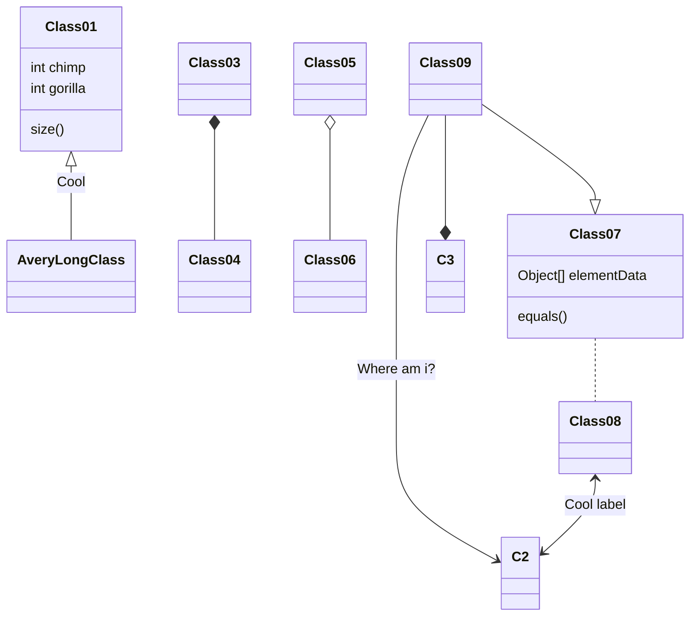

# xử lý 1 request thông thường
>Request -> check authen -> check author -> validation -> process raw request data -> update database -> Response ( json)

-   Check Authen: sử dụng middleware mặc định của Laravel
-   Check Authorization: đơn giản nhất sử dụng [ACL](https://laravel.com/docs/10.x/authorization) mặc định của Laravel 
-   Validation: sử dụng [Form Request](https://laravel.com/docs/10.x/validation#form-request-validation) của Laravel 
-   Process Raw data: tách ra thành các class riêng gọi là services -> nhớ luôn phải tạo interface và inject interface đó vào trong controller nhé
-   Tương tác với database: Sử dụng repository, inject vào service.

> Written with [StackEdit](https://stackedit.io/).
<!--stackedit_data:
eyJoaXN0b3J5IjpbMTI2NDIyNDQ2NiwtOTQ2MzI3NjU0XX0=
-->