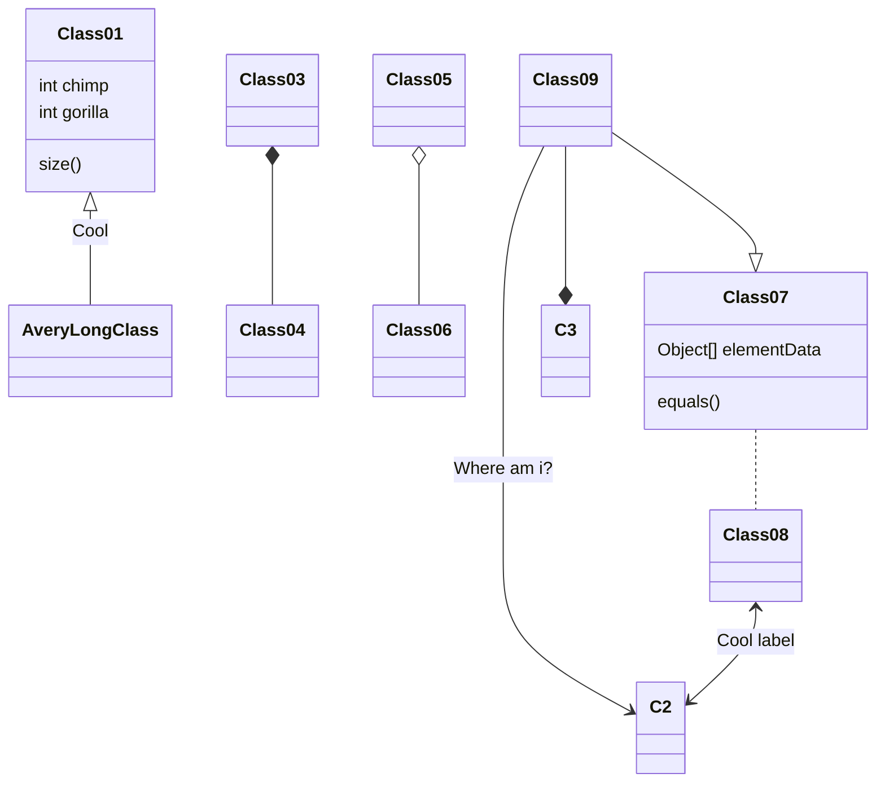

# heloworld 
kiến trúc code là gì?
> Theo mình, nó đơn giản lắm, chỉ là cách sắp đặt code để đạt được 1 mục đích nhất định.

> Written with [StackEdit](https://stackedit.io/).
<!--stackedit_data:
eyJoaXN0b3J5IjpbMjcwMTA1NjM4XX0=
-->