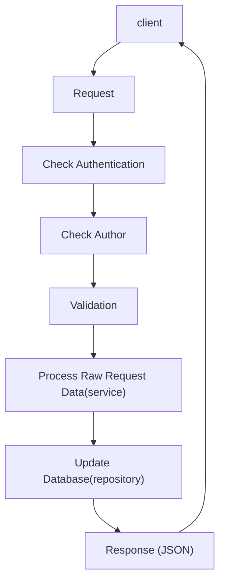

# xử lý 1 request thông thường



-   Check Authen: sử dụng middleware mặc định của Laravel
-   Check Authorization: đơn giản nhất sử dụng [ACL](https://laravel.com/docs/10.x/authorization) mặc định của Laravel 
-   Validation: sử dụng [Form Request](https://laravel.com/docs/10.x/validation#form-request-validation) của Laravel 
-   Process Raw data: tách ra thành các class riêng gọi là services -> nhớ luôn phải tạo interface và inject interface đó vào trong controller 
-   Tương tác với database: Sử dụng repository, inject vào service.

## Ví dụ
CRUD liên quan tới Book (title, author)

1. Tạo migration, controller, model và route
2. Áp middleware cho Authentication và authorize (nếu có)
```php
Route::middleware(['auth'],['can:admin.book'])->group( function () {
    Route::resource('/books', 'BooksController');
});
```
3. Dùng request để validate
php artisan make:request CreateBookRequest
php artisan make:request EditBookRequest
trong controller
```php
public function store(CreateBookRequest $request)
public function update(EditBookRequest $request, $id)
```
4. Tạo Repository
- interface
```php
interface BookRepositoryContract
{
    public function paginate();
    public function find($id);
    public function store($data);
    public function update($id, $data);
    public function destroy($id);
}
```
- repository
```php
class BookRepository implements BookRepositoryContract
{
    protected $model;

    public function __construct(Book $model)
    {
        $this->model = $model;
    }

    public function paginate()
    {
        return $this->model->paginate(10);
    }

    public function find($id)
    {
        return $this->model->findOrFail($id);
    }

    public function store($data)
    {
        return $this->model->create($data);
    }

    public function update($id, $data)
    {
        $model = $this->find($id);
        return $model->update($data);
    }

    public function destroy($id)
    {
        $model = $this->find($id);
        return $model->destroy($id);
    }

}
```
- bind trong service provider (tạm gọi là core)
```php
$this->app->bind(BookRepositoryContract::class, BookRepository::class);

```
5.  Tạo Services
```php
<?php

namespace Core\Services;

interface BookServiceContract
{
    public function paginate();
    public function find($id);
    public function store($data);
    public function update($id, $data);
    public function destroy($id);
}
```
6.  Chỉnh sửa BooksController để nhúng service vào
```php
<?php

namespace App\Http\Controllers;

use Illuminate\Http\Request;
use App\Http\Requests\EditBookRequest;
use Core\Services\BookServiceContract;
use App\Http\Requests\CreateBookRequest;

class BooksController extends Controller
{
    protected $service;

    public function __construct(BookServiceContract $service)
    {
        $this->service = $service;
    }


    public function index()
    {
        $items = $this->service->paginate();
        return view('books.index', compact("items"));
    }

    public function create()
    {
        return view('books.create');
    }

    public function store(CreateBookRequest $request)
    {
        $this->service->store($request->all());
        return redirect()->route('books.index');
    }

    public function show($id)
    {
        $item = $this->service->find($id);
        return view('books.show', compact('item'));
    }

    public function edit($id)
    {
        $item = $this->service->find($id);
        return view('books.edit', compact('item'));
    }

    public function update(EditBookRequest $request, $id)
    {
        $this->service->update($id, $request->all());
        return redirect()->route('books.index');
    }

    public function destroy($id)
    {
        $this->service->destroy($id);
        return redirect()->route('books.index');
    }
}
```

<!--stackedit_data:
eyJoaXN0b3J5IjpbNTcyNDE0ODU3LC05NDYzMjc2NTRdfQ==
-->