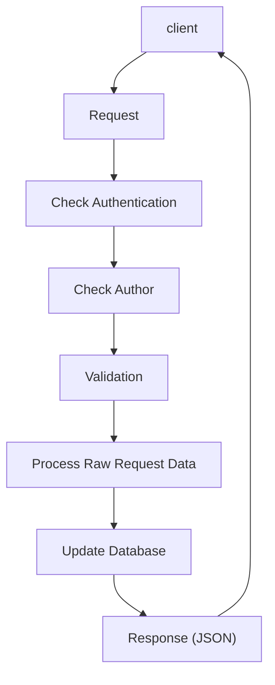

# xử lý 1 request thông thường

-   Check Authen: sử dụng middleware mặc định của Laravel
-   Check Authorization: đơn giản nhất sử dụng [ACL](https://laravel.com/docs/10.x/authorization) mặc định của Laravel 
-   Validation: sử dụng [Form Request](https://laravel.com/docs/10.x/validation#form-request-validation) của Laravel 
-   Process Raw data: tách ra thành các class riêng gọi là services -> nhớ luôn phải tạo interface và inject interface đó vào trong controller 
-   Tương tác với database: Sử dụng repository, inject vào service.

<!--stackedit_data:
eyJoaXN0b3J5IjpbMjA1NDI3Nzc4MCwtOTQ2MzI3NjU0XX0=
-->